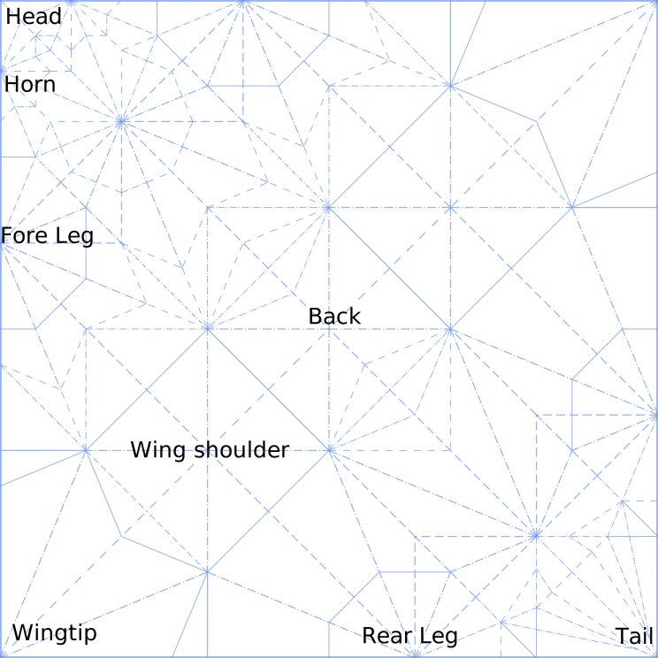

# [Origami Western Dragon](https://caseyshields.github.io/dragon/)

[SVG Diagrams for folding a 6 limbed dragon](https://caseyshields.github.io/dragon/). The design is based on multiples of 22.5 degrees, and has plenty of room for customization. I use [Vue](https://vuejs.org/) components to generate the sections, diagrams and annotations from a javascript array and a bunch of carefully named images. The images themselves were made using [Inkscape](https://inkscape.org/en/).

This is one of my earlier designs, though I actually didn't figure out the exact construction of the landmark points until I learned of the 'crossing diagonals' method years later. Which, if you are interested in tiled origami designs, is a really good trick to know. Robert lang has a great description on page 12 of this [paper](https://azdoc.pl/lang-rj-origami-and-geometric-constructions.html). There's also a lot of other good stuff in there for grid folders and such.

I greatly enjoyed [teaching this model](https://origamiusa.org/classes/pcoc/2017/western-dragon) at the [Pacific Coast Origami Convention](https://origamiusa.org/pcoc2017). I met a lot of great people and learned some really cool origami models there. I highly recommend attending if you like this kind of thing!

Unfortunately for these illustrations, I didn't really know what I was doing. Apart from the SVG being extremely bloated, Every single line is a disconnected SVG <line> tag rather than a closed path. This means I can't color in the sides of the paper. Wish I figured that out a hundred illustrations ago. Dang.

Anyways, enjoy!

